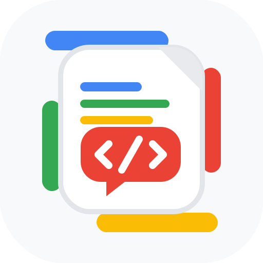

<div align="center">
  <h1>GAS Slack Bot Skill</h1>
  
  <p>
    
    
    
    
  </p>
  <p>
    <a href="./README.md">
      
    </a>
    <a href="./README.ja.md">
      
    </a>
  </p>
</div>

Build and configure a Google Apps Script x Slack bot by combining local scaffolding with a logged-in Chrome setup workflow.

This repository packages a reusable Codex skill for the full setup path:

- scaffold a GAS Slack bot repository
- create the Apps Script project
- create and install the Slack App
- configure Script Properties and Event Subscriptions
- verify the bot with a live Slack message

It is designed to work together with the related [`logged-in-google-chrome-skill`](https://github.com/Sunwood-ai-labs/logged-in-google-chrome-skill), so Google and Slack setup can be completed inside an already logged-in Chrome session attached over CDP.

[Japanese README](./README.ja.md) | [Docs Site](https://sunwood-ai-labs.github.io/gas-slack-bot-skill/)

## What This Skill Includes

- [`SKILL.md`](./SKILL.md): the main skill instructions and workflow
- [`scripts/scaffold_gas_slack_bot.ps1`](./scripts/scaffold_gas_slack_bot.ps1): a PowerShell scaffold script for creating a target GAS Slack bot repo
- [`assets/templates`](./assets/templates): reusable templates for Apps Script, Slack manifest, and repo bootstrap files
- [`references/end-to-end-flow.md`](./references/end-to-end-flow.md): the recommended end-to-end execution order
- [`references/blockers-and-workarounds.md`](./references/blockers-and-workarounds.md): common failure modes and recovery strategies

## When To Use It

Use this skill when you want Codex to:

- build a Slack bot on Google Apps Script
- complete both Google-side and Slack-side setup
- work through real browser UI for Apps Script and Slack App settings
- rely on a logged-in Chrome profile instead of a fresh Playwright-launched browser

## Quick Start

1. Use the related [`logged-in-google-chrome-skill`](https://github.com/Sunwood-ai-labs/logged-in-google-chrome-skill) to launch or attach to the dedicated Chrome session.
2. Scaffold a target bot repo with:

```powershell
powershell -ExecutionPolicy Bypass -File .\scripts\scaffold_gas_slack_bot.ps1 `
  -TargetRepoPath D:\Prj\my-slack-bot `
  -BotName "Slack Parrot Bot" `
  -TeamId T0AL9FZTL72 `
  -ChannelId C0AJZQJCVTR
```

3. Follow the full workflow in [`SKILL.md`](./SKILL.md).
4. If browser setup gets stuck, check [`references/blockers-and-workarounds.md`](./references/blockers-and-workarounds.md).

## Repository Structure

```text
gas-slack-bot-skill/
|- SKILL.md
|- LICENSE
|- README.md
|- README.ja.md
|- docs/
|- agents/
|  `- openai.yaml
|- scripts/
|  `- scaffold_gas_slack_bot.ps1
|- references/
|  |- end-to-end-flow.md
|  `- blockers-and-workarounds.md
`- assets/
   `- templates/
      |- Code.js
      |- appsscript.json
      |- package.json
      |- .clasp.json.example
      |- .gitignore
      |- README.md
      `- slack-app-manifest.json
```

## Notes

- Secrets are expected to live in Apps Script `Script Properties`, not in the generated repository.
- The default implementation uses Slack verification-token payload checking because Apps Script Web Apps do not expose the request-signature headers in a practical way.
- For a stricter security model based on Slack signing secret verification, migrate the runtime to a platform that exposes raw HTTP headers, such as Cloud Run or Cloud Functions.
- VitePress documentation is included under `docs/` and is intended to publish from `.github/workflows/deploy-docs.yml`.

## Published Docs

- Public repository: [Sunwood-ai-labs/gas-slack-bot-skill](https://github.com/Sunwood-ai-labs/gas-slack-bot-skill)
- Docs site: [sunwood-ai-labs.github.io/gas-slack-bot-skill](https://sunwood-ai-labs.github.io/gas-slack-bot-skill/)
